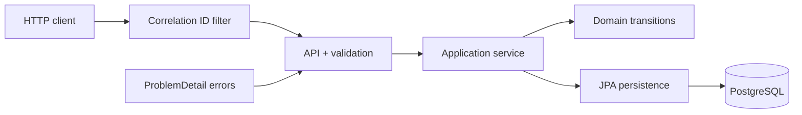

# Distributed Event Watchdog

Spring Boot MVP for receiving distributed flow events, tracking each flow by `traceId`, and
reporting whether it is started, waiting, expired, or completed.

## Problem Understanding

Distributed business flows often span several services. One event may declare which event must
arrive next and how long the flow can wait. The watchdog needs to preserve event history, expose
the current trace state efficiently, handle sender retries safely, and make expiration visible
without introducing a scheduler or messaging platform.

The public API is intentionally small:

- `POST /api/events` receives an event and advances its trace.
- `GET /api/traces/{traceId}/status` returns current state and evaluates TTL expiration lazily.

## Solution Summary

The solution is a modular monolith built with Java 21, Spring Boot 4.0.2, WebMVC, JPA, and
PostgreSQL. It separates API contracts, orchestration, domain rules, persistence, and error
handling while avoiding infrastructure that the MVP does not need.

Key choices:

- Store immutable history in `trace_events` and current state in `trace_states`.
- Calculate deadlines as `occurredAt + nextEventTtlSeconds`.
- Evaluate and persist expiration when trace status is queried.
- Treat duplicate `eventId` delivery as idempotent replay.
- Reject unexpected, late, and post-terminal events with `409 Conflict`.
- Use optimistic locking on current trace state.
- Store flexible event metadata as PostgreSQL `jsonb`.

## Architecture



The application service owns transaction boundaries and persistence orchestration. State
transition rules remain plain Java and are testable without Spring wiring. This MVP deliberately
does not introduce ports/adapters; those become useful if storage is later replaced.

### Package Structure

```text
com.clara.challenge
|-- HealthController
`-- eventwatchdog
    |-- api
    |   `-- dto
    |-- application
    |-- domain
    |-- persistence
    `-- error
```

- `api`: REST controller, correlation filter, and OpenAPI metadata.
- `api.dto`: immutable request and response records.
- `application`: transactions, idempotency, persistence orchestration, and business logs.
- `domain`: status model and deterministic state transitions.
- `persistence`: JPA entities and Spring Data repositories.
- `error`: conflict/not-found exceptions and consistent API error mapping.

More detail is available in [docs/ARCHITECTURE.md](docs/ARCHITECTURE.md).

## Data Model

|     Table      |                     Purpose                     |                                             Important details                                              |
|----------------|-------------------------------------------------|------------------------------------------------------------------------------------------------------------|
| `trace_events` | Immutable audit history and duplicate detection | Primary key `event_id`; event time and receive time; expectation fields; `jsonb` metadata                  |
| `trace_states` | Fast current-status lookup                      | Primary key `trace_id`; latest event; waiting deadline; event count; completion time; optimistic `version` |

The initialization DDL lives in
[`docker/init-scripts/db/01-init-schema.sql`](docker/init-scripts/db/01-init-schema.sql). Database
constraints protect enum values, positive TTL/count values, paired expectation fields, and waiting
deadline structure. Indexes support trace history, status, and deadline lookups.

## Status Model

|         Status          |                                   Meaning                                   |
|-------------------------|-----------------------------------------------------------------------------|
| `STARTED`               | At least one event was accepted; the trace is neither waiting nor complete. |
| `WAITING_OTHER_EVENT`   | The latest event declared an expected event whose deadline has not expired. |
| `TTL_EXPIRED_FOR_EVENT` | Status lookup observed that the expected-event deadline had passed.         |
| `COMPLETED`             | An accepted event had `finalEvent = true`.                                  |

`TTL_EXPIRED_FOR_EVENT` and `COMPLETED` are terminal for new events in this MVP. Duplicate replay
remains idempotent for terminal traces.

## API

The application context path is `/api`.

| Method |              Path              |                      Success responses                       |
|--------|--------------------------------|--------------------------------------------------------------|
| `POST` | `/api/events`                  | `201 Created` for a new event; `200 OK` for duplicate replay |
| `GET`  | `/api/traces/{traceId}/status` | `200 OK`; unknown traces return `404 Not Found`              |

Validation failures return `400 Bad Request`. Business conflicts return `409 Conflict` using a
`ProblemDetail` response with a stable conflict `code`.

### Ingest an Event

```bash
curl -i http://localhost:8080/api/events \
  -H 'Content-Type: application/json' \
  -H 'X-Correlation-Id: reviewer-example-001' \
  -d '{
    "eventId": "evt-001",
    "traceId": "trace-123",
    "eventName": "APPLICATION_RECEIVED",
    "result": "SUCCESS",
    "occurredAt": "2099-06-15T10:00:00Z",
    "nextExpectedEvent": "RULES_EVALUATED",
    "nextEventTtlSeconds": 120,
    "finalEvent": false,
    "metadata": {
      "country": "MX"
    }
  }'
```

Example `201 Created` body:

```json
{
  "traceId": "trace-123",
  "status": "WAITING_OTHER_EVENT",
  "lastEventId": "evt-001",
  "lastEventName": "APPLICATION_RECEIVED",
  "lastEventResult": "SUCCESS",
  "nextExpectedEvent": "RULES_EVALUATED",
  "waitingSince": "2099-06-15T10:00:00Z",
  "nextExpectedBefore": "2099-06-15T10:02:00Z",
  "eventsReceived": 1,
  "completedAt": null
}
```

`nextExpectedEvent` and `nextEventTtlSeconds` are optional, but they must be provided together.
`result = ERROR` describes the event outcome; it does not automatically complete the trace.

### Query Trace Status

```bash
curl -i http://localhost:8080/api/traces/trace-123/status
```

The response uses the same status representation shown above. If a waiting deadline has passed,
this request materializes `TTL_EXPIRED_FOR_EVENT` before returning the response.

## Edge-Case Behavior

|                          Case                           |                        Behavior                         |
|---------------------------------------------------------|---------------------------------------------------------|
| Duplicate `eventId`, same trace                         | Return `200 OK`; do not append history or mutate state. |
| Duplicate `eventId`, different trace                    | Return `409 Conflict`.                                  |
| Unexpected event while waiting                          | Return `409 Conflict`.                                  |
| Expected event whose `occurredAt` is after the deadline | Return `409 Conflict`.                                  |
| New event after `COMPLETED`                             | Return `409 Conflict`.                                  |
| New event after `TTL_EXPIRED_FOR_EVENT`                 | Return `409 Conflict`.                                  |
| First event is final                                    | Complete the trace immediately.                         |
| Unknown `traceId`                                       | Return `404 Not Found`.                                 |

The MVP is intentionally strict: it does not buffer or reorder unexpected events.

## TTL Decision

The deadline is calculated from business event time:

```text
nextExpectedBefore = occurredAt + nextEventTtlSeconds
```

There is no scheduler, background worker, or durable timer. `GET /api/traces/{traceId}/status`
compares the current time with the stored deadline and persists expiration when necessary. This is
simple and deterministic for the challenge, though it does not proactively alert when no client
queries the trace.

## OpenAPI

With the application running:

- OpenAPI JSON: [http://localhost:8080/api/v3/api-docs](http://localhost:8080/api/v3/api-docs)
- Swagger UI redirect: [http://localhost:8080/api/swagger-ui.html](http://localhost:8080/api/swagger-ui.html)
- Swagger UI page: [http://localhost:8080/api/swagger-ui/index.html](http://localhost:8080/api/swagger-ui/index.html)

The project relies on springdoc defaults under the existing `/api` context path.

## Correlation IDs And Logging

Every HTTP response includes `X-Correlation-Id`:

- A non-blank incoming value is preserved.
- A missing or blank value is replaced with a generated UUID.
- The value is available to request logs through MDC key `correlationId` and removed after the
  filter chain completes.

The console pattern renders `no-correlation-id` outside an HTTP request. Logs cover accepted
events, duplicate replay, conflicts, lazy expiration, unknown trace lookup, and completion without
logging metadata payloads.

## Running The Application

Prerequisites:

- Java 21
- Docker Desktop or a compatible Docker runtime
- Hurl for end-to-end validation

Prepare the local Docker environment once:

```bash
cp docker/example.env docker/.env
```

Ensure the PostgreSQL values match `src/main/resources/application.yaml`, then start the app:

```bash
./mvnw spring-boot:run
```

Spring Boot starts the existing Compose stack automatically. Full setup and troubleshooting are
documented in [SETUP.md](SETUP.md).

## Testing And Verification

### Unit And Build Verification

```bash
./mvnw test
./mvnw clean spotless:apply verify
```

The domain suite covers state transitions and terminal/conflict rules. Application tests cover
persistence orchestration and lazy expiration. Lightweight servlet tests cover correlation ID
propagation, UUID generation, and MDC cleanup.

### Hurl E2E Tests

The application must already be running. Hurl tests validate only the public HTTP API; they do not
query or assert internal database state.

Direct execution:

```bash
hurl --test --variable runId="$(date +%Y%m%d%H%M%S)-$RANDOM" hurl/*.hurl
```

Script wrapper:

```bash
./scripts/run-hurl-tests.sh
```

Optional explicit run ID:

```bash
RUN_ID=my-local-run ./scripts/run-hurl-tests.sh
```

`runId` is injected into every test `eventId` and `traceId`, preventing collisions across normal
repeated runs against the same database. Deliberately reusing an old explicit ID can reproduce a
collision.

The suite covers required statuses, duplicate replay, unexpected and late events, terminal trace
conflicts, unknown traces, and correlation ID propagation.

## Validation Summary

|                Check                 |                               Final result                                |
|--------------------------------------|---------------------------------------------------------------------------|
| `./mvnw clean spotless:apply verify` | Passed; JAR packaged, Spotless clean, 23 tests passed                     |
| `./mvnw spring-boot:run`             | Passed; PostgreSQL healthy, application running on port 8080 under `/api` |
| `./scripts/run-hurl-tests.sh`        | Passed; 11 files and 21 HTTP requests, zero failures                      |
| OpenAPI                              | JSON and Swagger UI endpoints verified during Phase 3B                    |

The application command runs in one terminal; Hurl runs in another. Detailed command history and
environment notes are recorded in [AI_USAGE.md](AI_USAGE.md).

## Assumptions And Technical Decisions

- PostgreSQL is the system of record because it is already part of the challenge stack.
- Event history and current state are stored separately for auditability and fast reads.
- Event names are strings so the MVP is not coupled to a fixed workflow catalog.
- Metadata is optional `jsonb`; it is stored but not interpreted by transition rules.
- Duplicate event delivery is expected in distributed systems and is idempotent by `eventId`.
- An expected event is considered late when its own `occurredAt` is after the stored deadline.
- A first final event is valid and immediately completes the trace.
- Optimistic locking protects concurrent updates without distributed locks.
- Hurl run IDs provide test isolation without routine database cleanup.

## Trade-Offs

- Lazy expiration avoids a scheduler but cannot emit proactive alerts.
- Maintaining history plus current state duplicates some data but makes both audit and lookup use
  cases straightforward.
- Strict conflicts keep behavior predictable but do not support out-of-order buffering.
- Database transactions and optimistic locking are sufficient for the MVP, but very high
  throughput may require partitioned ingestion and retry handling.
- Plain SQL initialization is simple for the challenge but lacks versioned production migrations.
- Correlation IDs improve log navigation but are not full distributed tracing.

## Future Improvements

- Broker-backed ingestion partitioned by `traceId` for ordering and scale.
- Durable timers, alerts, or scheduled expiration when proactive notification is required.
- Retry handling for optimistic-lock conflicts under concurrent delivery.
- Versioned migrations with Flyway or Liquibase.
- Metrics, tracing propagation, dashboards, and structured logs.
- Configurable workflow definitions and explicit out-of-order policies.
- Authentication, authorization, and tenant boundaries if exposed beyond a trusted environment.

## Supporting Documentation

- [SETUP.md](SETUP.md): environment setup and troubleshooting.
- [TASKS.md](TASKS.md): phased implementation plan and status.
- [AI_USAGE.md](AI_USAGE.md): prompts, accepted/rejected suggestions, corrections, and validation.
- [docs/ARCHITECTURE.md](docs/ARCHITECTURE.md): detailed architecture decisions and flows.

