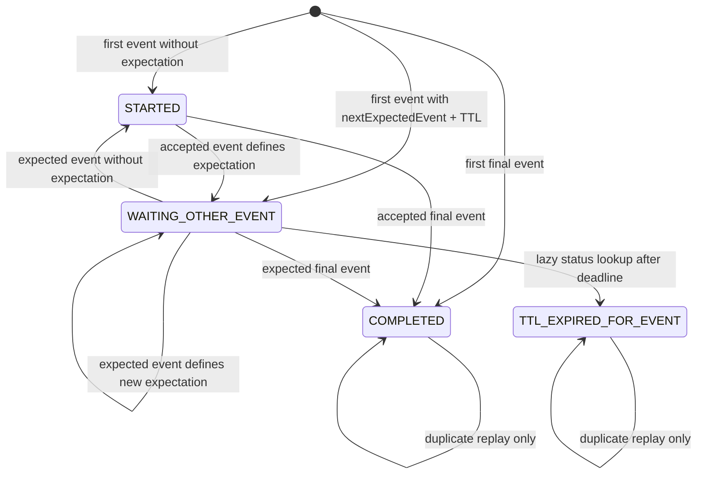
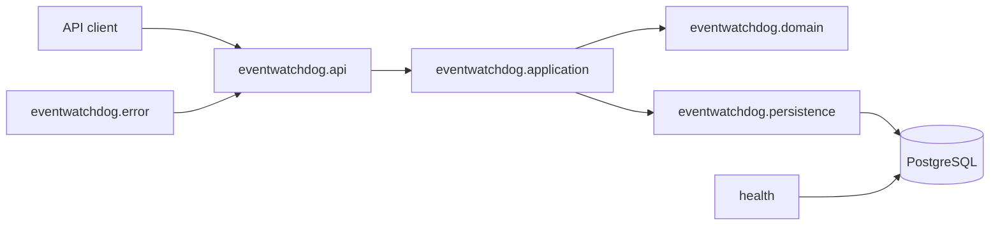
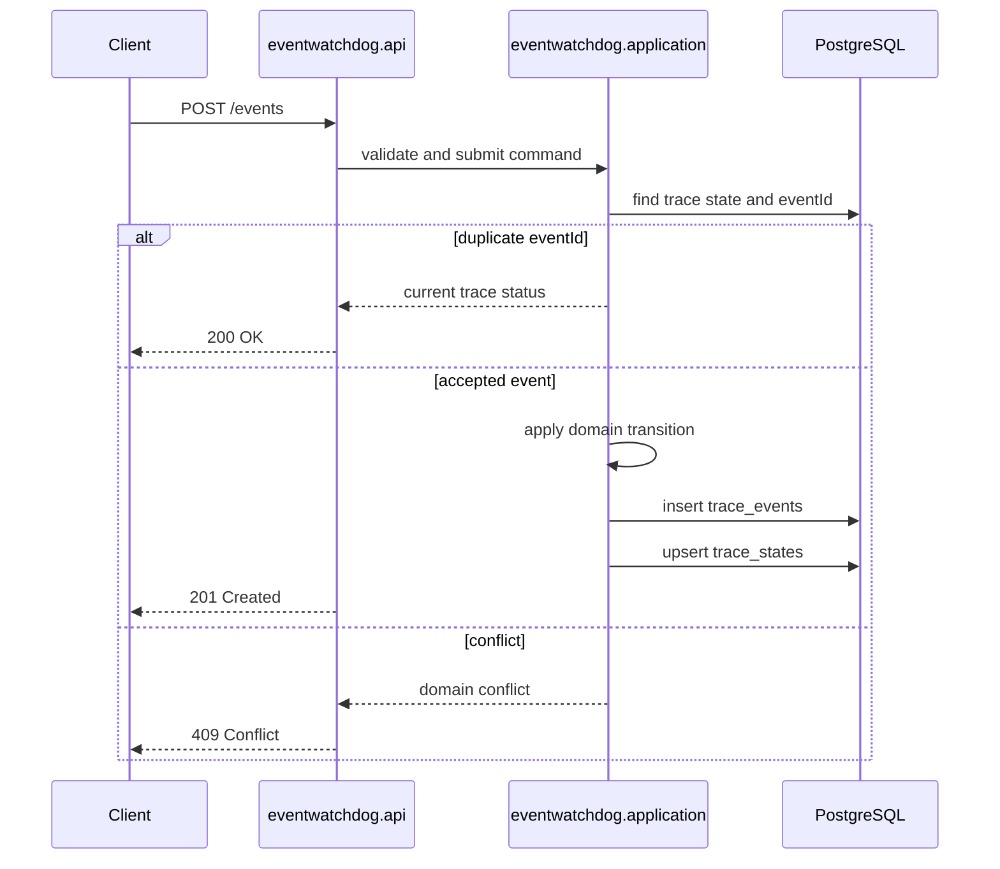
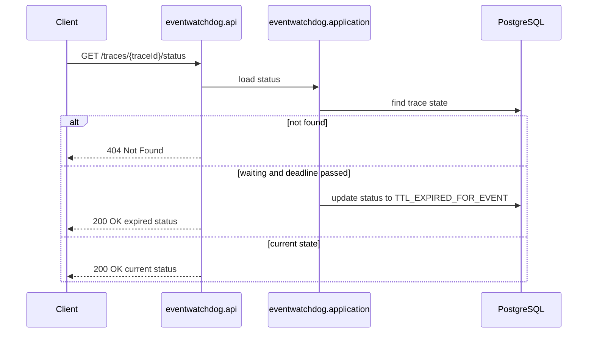

# Architecture

## Architecture Style

The MVP uses a modular monolith organized around the `eventwatchdog` business capability. It
keeps the service easy to navigate while separating API contracts, orchestration, business rules,
persistence, and error handling.

This phase does not introduce ports/adapters. Explicit persistence ports can be added later if
storage changes, for example to DynamoDB or an event stream.

## Package Structure

```text
com.clara.challenge
|-- health
`-- eventwatchdog
    |-- api
    |   `-- dto
    |-- application
    |-- domain
    |-- persistence
    `-- error
```

- `api`: REST controllers.
- `api.dto`: request and response records.
- `application`: use-case orchestration and transaction boundaries.
- `domain`: state transition rules, enums, commands, and snapshots.
- `persistence`: JPA entities and Spring Data repositories.
- `error`: exception types and API error handling.

## Request Flow

The challenge describes the logical endpoints as:

- `POST /events`
- `GET /traces/{traceId}/status`

Because the application is configured with the `/api` context path, the public HTTP endpoints
exposed by the application are:

- `POST /api/events`
- `GET /api/traces/{traceId}/status`

`POST /api/events` validates the request, checks duplicate `eventId`, applies trace transition
rules, stores the immutable event, updates current trace state, and returns the current trace
status.

`GET /api/traces/{traceId}/status` loads current trace state, evaluates TTL lazily, materializes
terminal expiration when needed, and returns a status snapshot. Unknown traces return
`404 Not Found`.

## State Transition Model

Supported statuses:

- `STARTED`: first accepted event exists, with no next expected event and not final.
- `WAITING_OTHER_EVENT`: the latest accepted event defined the next expected event and TTL.
- `TTL_EXPIRED_FOR_EVENT`: the expected event did not arrive by its deadline.
- `COMPLETED`: an accepted event had `finalEvent = true`.

Rules:

- A first event with `finalEvent = true` completes the trace immediately.
- `result = ERROR` is an event outcome, not the global trace status.
- `nextExpectedEvent` and `nextEventTtlSeconds` must be provided together.
- Unexpected event while waiting for a different event returns `409 Conflict`.
- Late expected event after the deadline returns `409 Conflict`.
- `COMPLETED` and `TTL_EXPIRED_FOR_EVENT` are terminal for the MVP, except duplicate replay.



## Data Model Strategy

PostgreSQL is used for the MVP because the repository already provides PostgreSQL, JPA, Docker
Compose, and SQL initialization scripts.

Store both immutable event history and current trace state:

- `trace_events`: audit/history table keyed by unique `event_id`.
- `trace_states`: current status lookup table keyed by `trace_id`.

Event metadata should be stored as PostgreSQL `jsonb`. This keeps metadata flexible while allowing
future targeted querying if needed.

DynamoDB is not used in the MVP. It is a future option if throughput, serverless architecture, or
storage access patterns justify moving away from relational storage.



## TTL Strategy

TTL is calculated from `occurredAt + nextEventTtlSeconds`. This makes behavior deterministic and
ties the deadline to business event time.

TTL expiration is evaluated lazily when `GET /traces/{traceId}/status` is called. There is no
scheduler, background job, custom thread, or durable timer in the MVP.

When a waiting trace is queried after its deadline, the status endpoint materializes the
deterministic expiration by updating the trace state to `TTL_EXPIRED_FOR_EVENT`. This makes
expiration terminal for the MVP and keeps future event ingestion consistent. The operation is
idempotent from the client perspective: repeated status lookups return the same expired state.

## Idempotency Strategy

Duplicate `eventId` is idempotent:

- do not insert the event again;
- do not mutate trace state again;
- return the current trace status with `200 OK`.

New accepted events return `201 Created`.

## Unexpected And Late Event Strategy

If a trace is waiting for `nextExpectedEvent = X` and receives `Y`, where `Y != X`, the request
returns `409 Conflict`.

If the expected event arrives after `nextExpectedBefore`, the request returns `409 Conflict`.

These rules keep the MVP strict and predictable. Production systems may add out-of-order buffering
or broker-level ordering before relaxing this behavior.

## Completed And Expired Trace Behavior

`COMPLETED` is terminal for the MVP. New non-duplicate events for a completed trace return
`409 Conflict`.

`TTL_EXPIRED_FOR_EVENT` is also terminal for the MVP. New non-duplicate events for an expired trace
return `409 Conflict`.

Duplicate replay remains idempotent for both terminal statuses.

## Java 21 Records And Lombok Usage

Use Java 21 records for immutable DTOs and small domain command/snapshot objects.

Use Lombok where it reduces boilerplate:

- `@RequiredArgsConstructor` for Spring services and controllers.
- `@Slf4j` for services and error handling where logs are useful.
- `@Getter`, `@Setter`, and `@NoArgsConstructor` for JPA entities.

Do not use `@Data` on JPA entities. Do not use MapStruct initially; manual mapping is simpler for
this MVP.

## Concurrency Strategy

Do not use custom threads, `ExecutorService`, `CompletableFuture`, `@Async`, or background workers.

Use transactional boundaries, database constraints, and optimistic locking on trace state. Unique
constraints handle duplicate `eventId`; a version column on `trace_states` should protect concurrent
updates to the same trace.

In production, ordering could be handled by a broker partitioned by `traceId`.

## Error Handling Strategy

Use a small `@RestControllerAdvice` in `eventwatchdog.error` for consistent JSON errors.

Expected mappings:

- validation failures: `400 Bad Request`;
- unknown trace lookup: `404 Not Found`;
- duplicate event replay: `200 OK` with current status;
- unexpected event, late event, completed trace conflict, expired trace conflict: `409 Conflict`;
- unexpected exceptions: `500 Internal Server Error`.

## Observability And Logging Strategy

Use meaningful, low-noise business logs.

Suggested levels:

- `INFO`: event accepted, duplicate replay handled, trace completed.
- `WARN`: TTL expired, unexpected event conflict, late event conflict, completed/expired trace
  conflict.
- `ERROR`: unexpected exceptions only.

Do not log full metadata payloads, sensitive information, or repository-level noise.

Optional lightweight correlation id support can be added later:

- accept `X-Correlation-Id`;
- generate one if absent;
- return it in the response;
- put it in MDC for logs.

## OpenAPI Strategy

OpenAPI/Swagger is useful but optional and time-boxed. It is not core to the first implementation
phase and must not block the core deliverables. Add it later only after REST endpoints are stable
and only if compatible with Spring Boot 4.0.2.

If dependency compatibility or time becomes a risk, `README.md` examples and Hurl tests are enough
for the MVP.

## Testing Strategy

Prefer plain unit tests for domain state transitions. Use Spring tests only for wiring,
persistence, and HTTP behavior that needs Spring.

Unit test coverage should include:

- first event creates a trace;
- event with next expected event moves to `WAITING_OTHER_EVENT`;
- final event moves to `COMPLETED`;
- TTL expiration returns `TTL_EXPIRED_FOR_EVENT`;
- duplicate event replay is idempotent;
- unexpected event returns conflict;
- late expected event returns conflict;
- completed and expired traces reject new non-duplicate events.

Hurl tests should validate public HTTP behavior only. They should not assert internal database
details.

## Out-Of-Scope Decisions

The MVP does not include:

- Kafka, SQS, Pub/Sub, RabbitMQ, or another broker;
- DynamoDB;
- Flyway or Liquibase;
- schedulers or background jobs;
- authentication or authorization;
- UI;
- distributed locks;
- custom worker threads;
- OpenAPI in the first implementation phase.

## Future Evolution

Possible production improvements:

- broker ingestion partitioned by `traceId`;
- durable expiration handling and alerting;
- explicit persistence ports if storage changes;
- DynamoDB or event-stream storage when access patterns justify it;
- richer observability and metrics;
- out-of-order buffering policies;
- trace version history;
- OpenAPI once endpoint contracts are stable.

## Event Ingestion Sequence



## Status Lookup Sequence



